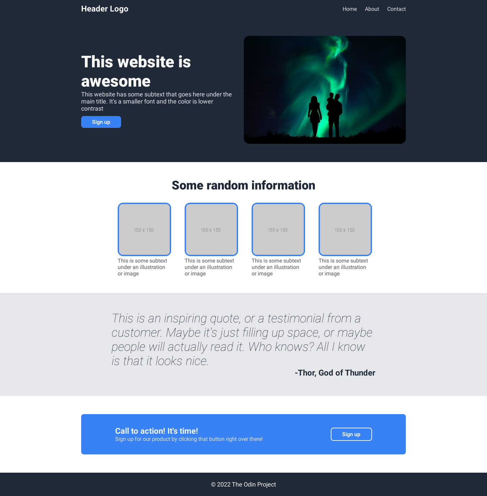
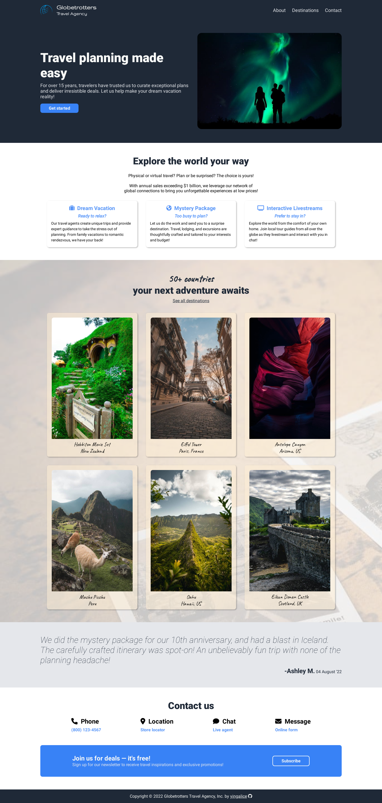

# odin-landing-page

## Live Site
- https://yingalice.github.io/odin-landing-page

## Description
- Landing page for fictitious travel agency
- Created for this [assignment](https://www.theodinproject.com/lessons/foundations-landing-page#assignment) in The Odin Project curriculum

## Goals
- Implement website from [given design](./img/design/odin-project.png)
- Practice
  - HTML
  - CSS
  - Flexbox
  - Media queries (self-learn)
  - BEM naming convention (self-learn)

## Progress Screenshots
- **Initial** - Followed design

- **Final** - Added customization

## Image Credits
[See list](./img-credits.md)